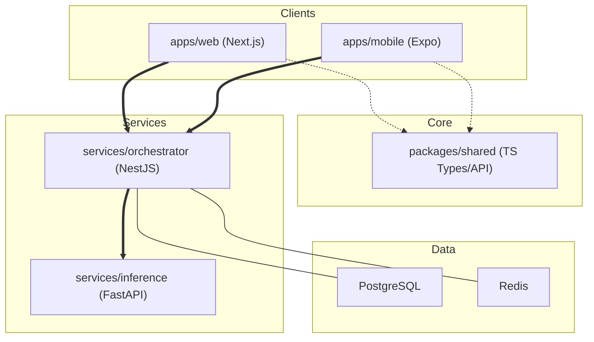

# Matcha-AI-DTU

Matcha-AI-DTU is a comprehensive AI-powered sports video analysis platform. It processes sports footage (specifically soccer/football), tracks the ball, automatically detects goals and events, generates insightful commentary using LLMs (Gemini), and synthesizes audio voiceovers for highlight reels.

This is a **monorepo** built with Next.js, NestJS, and FastAPI, orchestrated with Docker.

---

## 🏗 Architecture Overview

The system is broken down into three main applications:



1. **[Frontend Web (apps/web)](./apps/web/README.md)**: A modern React interface built with Next.js 15. Handles video uploads, live processing status, and the match dashboard.
2. **[Frontend Mobile (apps/mobile)](./apps/mobile/README.md)**: A React Native cross-platform app built with Expo and Expo Router. Shares API logic and types with the web app via a local package.
3. **[Orchestrator (services/orchestrator)](./services/orchestrator/README.md)**: A NestJS API backend. Manages state (Prisma/Postgres, Redis), WebSockets, and delegates AI tasks to the Inference service.
4. **[Shared Package (packages/shared)](./packages/shared)**: The single source of truth for TypeScript types, API client factories, and data transformation utilities used by both web and mobile.
5. **[Inference Engine (services/inference)](./services/inference/README.md)**: Python FastAPI service running YOLOv8, Gemini LLM analysis, and TTS generation.

---

## ✨ Key Features

- **Automated Video Analysis**: Upload raw sports footage and let the system automatically analyze the content.
- **Advanced Goal Detection**: Custom Goal Detection Engine built with YOLO that auto-calibrates to the goal line, tracks the ball across frames, and confirms goals with high precision.
- **Action Event Recognition**: Detects other gameplay events (fouls, tackles, celebrations) augmenting the analysis.
- **AI Commentary Generation**: Context-aware, natural-sounding commentary generated by the Gemini API describing the on-field action.
- **Text-To-Speech (TTS) Pipeline**: Uses Piper TTS for seamless, offline, high-quality voiceover generation.
- **Real-Time Progress Tracking**: WebSocket integration provides users with live updates across the 4-phase analysis pipeline.

---

## 🚀 Quick Start Guide

### Prerequisites

| Tool | Version | Purpose |
|------|---------|---------|
| Node.js | 18+ | Frontend & Orchestrator |
| Python | 3.11/3.12 | Inference service |
| Docker Desktop | Latest | Required for PostgreSQL & Redis containers |
| FFmpeg | Latest | Required for Video processing |
| NVIDIA GPU | CUDA 12.4 | Recommended for fast PyTorch acceleration |

### 1. Launch Infrastructure
Start the database and Redis cache utilizing Docker Compose:
```bash
docker compose up -d
```
*This starts PostgreSQL on port 5433 and Redis on port 6380.*

### 2. Install Node Dependencies
Install all JavaScript dependencies seamlessly via turbo:
```bash
npm install
```
Then, deploy the database schema in the orchestrator:
```bash
cd services/orchestrator
npx prisma generate
npx prisma migrate deploy
```

### 3. Setup Python Inference Environment
The inference service requires its own Python environment with specific dependencies:
```bash
cd services/inference

# Create & activate a Python 3.11 virtual environment
py -3.11 -m venv venv
.\venv\Scripts\activate

# Upgrade pip
pip install --upgrade pip

# Install PyTorch with CUDA 12.4 support (if you have an NVIDIA GPU)
pip install torch torchvision torchaudio --index-url https://download.pytorch.org/whl/cu124

# Install the rest of the dependencies
pip install -r requirements.txt
pip install piper-tts
```

### 4. Configure Environment Variables
Create `.env` files where required.
For **services/inference**, set up the following environment variables (or export them):
- `ORCHESTRATOR_URL="http://localhost:4000"`
- `GEMINI_API_KEY="your-gemini-api-key"`

### 5. Start the Services

You will need multiple terminal windows (or multiplexer panes) to run all services simultaneously.

**Terminal 1 - Orchestrator (Port 4000)**
```bash
cd services/orchestrator
npm run start:dev
```

**Terminal 2 - Inference Engine (Port 8000)**
*Ensure the python virtual environment is activated*
```bash
cd services/inference
# (if Windows Powershell)
$env:ORCHESTRATOR_URL="http://localhost:4000"
$env:GEMINI_API_KEY="your-api-key"
uvicorn main:app --host 0.0.0.0 --port 8000
```

**Terminal 3 - Frontend Web App (Port 3000)**
```bash
cd apps/web
npm run dev
```

---

## 🛠 Project Structure

```text
Matcha-AI-DTU/
├── apps/
│   ├── web/              # Next.js 15 Web App
│   └── mobile/           # Expo (React Native) Mobile App
├── packages/
│   └── shared/           # @matcha/shared — Types, Client, Utils
├── services/
│   ├── orchestrator/     # NestJS API (Port 4000)
│   └── inference/        # Python FastAPI AI Pipeline (Port 8000)
├── uploads/              # Global video/audio assets
├── SETUP.md              # Detailed setup documentation
└── docker-compose.yml    # Database & Redis infrastructure
```

---

## 💡 Troubleshooting Solutions

- **Ports already in use:** Use `netstat -ano | Select-String ":3000"` to find and kill conflicting operations.
- **Postgres/Redis connection failures:** Ensure Docker daemon is running and containers haven't exited (`docker ps -a`).
- **Python Import errors (TTS/Torch):** Double-check that your `venv` is activated. Piper TTS should be installed separately via `pip install piper-tts` which provides pre-built binaries without requiring heavy C++ compilation.
- **Analysis stuck at 0%:** Ensure `ORCHESTRATOR_URL` is correct in the Inference service. The WebSocket link may be unreachable.

---
*Built for Matcha-AI-DTU*
