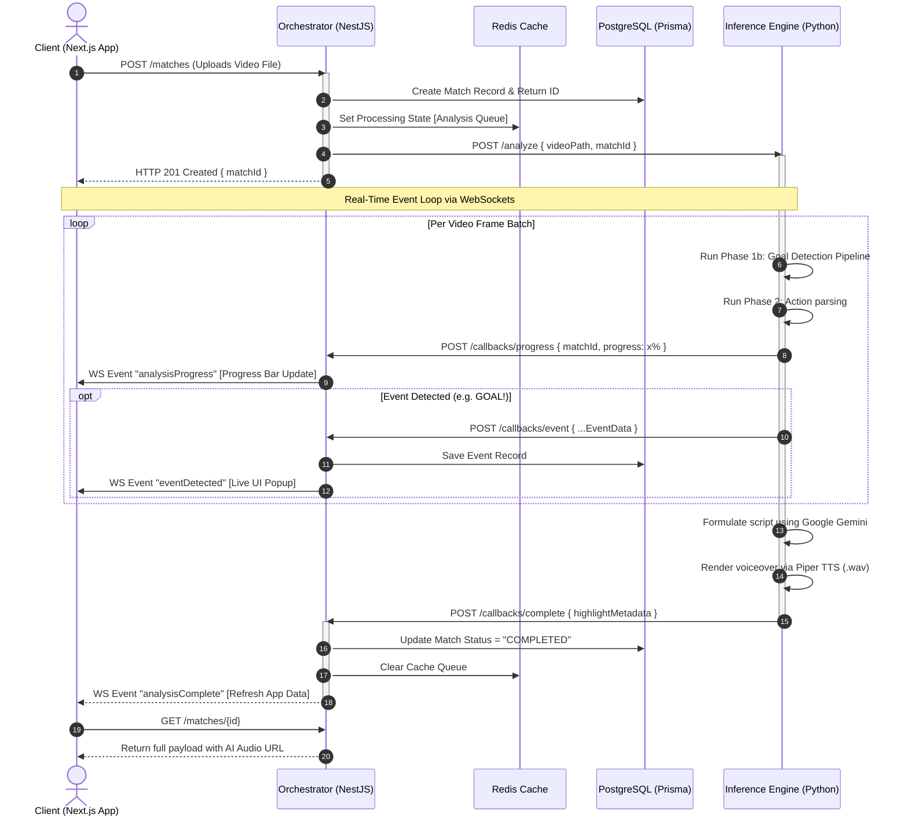
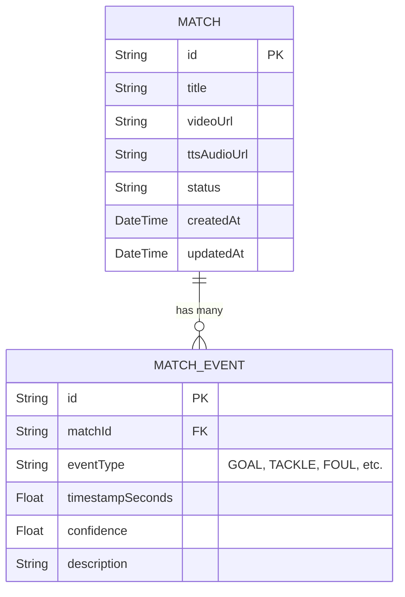

# 🏗 System Architecture

Matcha-AI-DTU utilizes a microservice-like **Monorepo** architecture leveraging specific languages for their native strengths: 
- **TypeScript/React** for dynamic, real-time UI mapping.
- **TypeScript/NestJS** for strictly-typed API gateways and WebSockets.
- **Python/FastAPI** for deep learning AI inference processing.

This document serves to visually explain how data flows across the monorepo when a user initiates a request.

---

## 🌊 The Core Video Analysis Data flow 

The primary end-to-end operation is ingesting a raw video, processing it through YOLO Computer Vision AI models and Large Language Models, and returning a generated Sports Highlight audio synthetic file dynamically to the browser. 

---

## 🗄️ Database Schema Diagram

We utilize Prisma ORM for type-safe database queries. The central entities revolve around `Match` (a video entity) and its children `MatchEvent`.

---

## 🔌 WebSockets Implementation (Socket.io)

For real-time progression we decouple the heavy Python operations from holding HTTP connections open using Callbacks and WebSockets.

1. **NestJS** mounts a Socket.IO Gateway on port `4000`.
2. When the **Inference (Python)** script processes frames, it issues a synchronous *fire-and-forget* HTTP request to the Orchestrator (`/callbacks/progress`).
3. The **Orchestrator** translates this HTTP payload into an active Socket Event mapped to all connected Next.js users listening to that namespace.
4. If a WebSocket disconnects, the analysis **continues uninterrupted** inside the Python environment, preventing dropped progress upon a user refreshing their browser.
