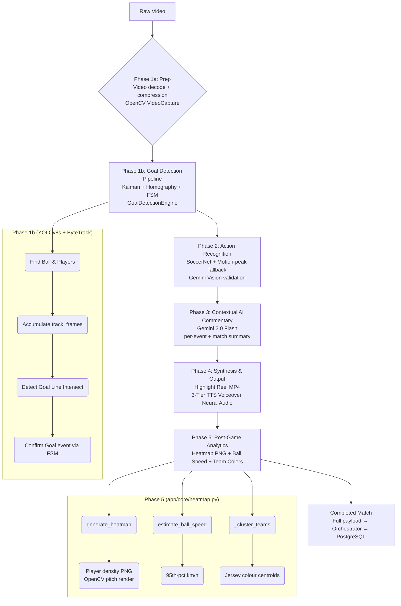

# AI Pipeline: The 5-Phase Architecture

Matcha-AI-DTU's Inference module runs on a highly structured **5-phase sequential pipeline**. This document breaks down the operations occurring when the Orchestrator delegates a video to `services/inference/app/core/analysis.py`.

> **Updated**: The original 4-phase pipeline has been extended to a 5-phase system. Phase 5 covers the new post-game analytics: player heatmap generation, ball speed estimation, and team colour detection.

## 🔄 The Pipeline Architecture



---

### 🎯 Phase 1a & 1b: Vision & Goal Detection (YOLOv8s + ByteTrack)

The video is initially parsed frame-by-frame via `cv2.VideoCapture`. To ensure real-time performance, we process frames in intervals (configurable via `CONFIG` constants in `analysis.py`, generally processing 1 frame per second of footage for large files, or every frame for pre-compressed input).

1. **Pre-compression**: If the video exceeds `COMPRESS_SIZE_THRESHOLD_MB` (default: 100MB), FFmpeg downscales it to 480p @ 1fps before the Python loop runs. This dramatically speeds up processing with minimal accuracy loss.
2. **Object Detection**: `YOLOv8s.pt` (the small model — 22MB, better GPU utilisation than nano) is executed per sampled frame to isolate `sports ball` and `person` bounding boxes simultaneously.
3. **YOLO Skip Optimisation**: Frames with very low motion score (`< YOLO_SKIP_MOTION_THRESHOLD`) are skipped for YOLO inference entirely, saving significant GPU time on static scenes.
4. **Jersey Colour Sampling**: For each detected `person` box, the torso region (rows 30–70%, cols 20–80%) is cropped and the median RGB pixel is extracted as that player's jersey colour sample.
5. **Ball & Person Tracking**: Every non-skipped frame's YOLO results are stored as a `track_frame` dict: `{"t": timestamp, "b": [[nx,ny,nw,nh,conf], ...], "p": [[nx,ny,nw,nh,tid,team], ...]}`. These normalised coordinates (0.0–1.0) are used both for canvas overlay rendering and for Phase 5 analytics.
6. **GoalDetectionEngine**: Per-frame, the specialised `GoalDetectionEngine` (Kalman filter + homography projection + finite state machine) also processes each frame independently to detect ball-crosses-goal-line events with high accuracy.

### 🏃 Phase 2: Action Recognition & Event Detection

While Goal Detection zeroes in on scoring, Phase 2 categorises a much wider range of events using a multi-model approach:

1. **SoccerNet Detector** (`app/core/soccernet_detector.py`): The primary event detector, trained specifically on football footage. Detects: `GOAL`, `SAVE`, `TACKLE`, `FOUL`, `CORNER`, `YELLOW_CARD`, `RED_CARD`, `PENALTY`, `OFFSIDE`, `CELEBRATION`.
2. **Motion-Peak Fallback**: If SoccerNet returns fewer than 3 events, high-motion peaks are detected via the `find_motion_peaks()` function operating on the rolling `motion_windows` list. These are classified as generic `HIGHLIGHT` events.
3. **Gemini Vision Validation** (`analyze_frame_with_vision()`): This was an earlier validation layer — candidate moments are analysed by Gemini Vision for multi-frame majority voting. Replaced in the primary path by SoccerNet, retained as a supplementary validation tool.
4. **Event Scoring**: Every detected event is passed through `compute_context_score()`, which weights: event type importance (GOAL=10, PENALTY=9.5 … OFFSIDE=2.5), motion intensity, temporal position (late goals doubly weighted), and detection confidence. Output is a `finalScore` 0–10.
5. **Live WebSocket Emission**: Each scored event is immediately posted to the orchestrator via `emit_live_event()`, which broadcasts it via Socket.IO to any connected frontend clients watching that match in real-time.

### 🧠 Phase 3: Generative Commentary (Google Gemini 2.0 Flash)

With the list of scored `Events` populated, Gemini generates per-event commentary and a full match summary:

1. **Per-event commentary** (`generate_commentary()`): A vivid 40–60 word live-broadcast style commentary string for each event. Prompted with event type, minute, intensity, and surrounding context events.
2. **Fallback templates** (`_FALLBACK` dict): Pre-written energy-levelled fallbacks (high/mid/low) for each event type, used when Gemini is unavailable.
3. **Match Summary** (`generate_match_summary()`): A 3–5 sentence analytical narrative of the entire match. Capped at 5000 characters and stored on the `Match` record.

### 🎙️ Phase 4: Audio & Highlight Reel Synthesis

The highlight reel pipeline (`create_highlight_reel()`) assembles a professional-grade broadcast video:

1. **Highlight Selection** (`select_highlights()`): Top-N non-overlapping highlight clips are chosen based on `finalScore`. Clips must be at least 15% of total match duration apart to ensure full-match spread.
2. **TTS Voiceover** (`tts_generate()`): Commentary text is synthesised using the **3-tier TTS system**:
   - **Tier 1**: `hexgrad/Kokoro-82M` via HuggingFace Inference API — #1 ranked in TTS-Spaces-Arena. Voice: `af_sky` (British female sports commentator). Requires `HF_TOKEN` env var.
   - **Tier 2**: `edge-tts` — `en-GB-RyanNeural` British male broadcaster. No API key. Always available.
   - **Tier 3**: FFmpeg `anullsrc` silent audio — absolute fallback if both neural backends fail.
3. **FFmpeg Clip Assembly**: For each highlight clip, FFmpeg:
   - Cuts the video segment (`-ss start -to end`)
   - Overlays scrolling text banner (`drawtext=x=w-mod(t*150\,w+tw)`)
   - Adds fade in/out (`fade=t=in:st=0:d=1`)
   - Mixes TTS voice + crowd ambience + background music (`amix`)
4. **Concatenation**: All clips are concatenated via FFmpeg `concat` demuxer into a single `highlight_reel_matchId.mp4` saved to `/uploads/`.

### 📊 Phase 5: Post-Game Analytics (NEW — `app/core/heatmap.py`)

After the highlight reel is built, Phase 5 runs a post-processing analytics pass on the already-collected `track_frames` data. No additional video read is needed.

#### Player Density Heatmap (`generate_heatmap()`)

1. Iterates all `track_frames`, extracts the bounding box centroid `(cx, cy)` of each detected player.
2. Increments a 2D NumPy float32 accumulator grid `(520×800)` at the centroid position — separately for Team A (index 0) and Team B (index 1).
3. Applies `cv2.GaussianBlur(kernel=51)` to both grids for smooth heatmap appearance.
4. Renders a top-down football pitch background using OpenCV: outer boundary rectangle, centre line, centre circle, penalty areas, 6-yard boxes, all in light-green on dark-green (`#1e501e`).
5. Blends each team's density grid as a coloured semi-transparent overlay using the team's KMeans-detected jersey colour.
6. Draws the ball trajectory as a fading yellow-cyan trail.
7. Adds a legend (Team A, Team B, Ball) in the bottom-left corner.
8. Saves the result as `heatmap_{matchId}.png` to the `/uploads/` shared directory.

#### Ball Speed Estimation (`estimate_ball_speed()`)

1. Extracts consecutive ball centroid positions `(t, cx_norm, cy_norm)` from `track_frames`.
2. For each consecutive pair, computes:
   - `Δx_metres = Δcx_norm × 105.0` (pitch width = 105m)
   - `Δy_metres = Δcy_norm × 68.0` (pitch height = 68m)
   - `speed_mps = sqrt(Δx² + Δy²) / Δt`
3. Gaps larger than 2 seconds (ball was lost/re-found) are ignored.
4. Returns the **95th percentile** of all frame-to-frame speed measurements, converted to km/h, clamped to 0–200 km/h. The 95th percentile is used rather than the maximum to filter extreme noise spikes from tracking loss artefacts.

#### Team Colour Clustering (`_cluster_teams()` in `analysis.py`)

1. Throughout the YOLO loop, each detected person's torso RGB median is collected into `jersey_colours`.
2. After the loop, NumPy-based mini K-Means (20 iterations, 2 centroids) clusters all samples into two team colour groups.
3. Each tracked player's raw `[r,g,b]` values are then replaced with their team index `{0, 1}` in `track_frames`, enabling team-separated visualisation.

---

## ⚙️ Customising the Pipeline

Developers modifying `app/core/analysis.py` should focus on the `CONFIG` dict:
```python
CONFIG = {
    "GOAL_DETECTION_MIN_FRAMES": 3,       # Lower for sensitivity, raise for accuracy
    "MIN_CONFIDENCE": 0.55,               # YOLO confidence threshold
    "VIDEO_PROCESS_FPS": 1.0,             # Frames per second to analyse
    "MOTION_PEAK_THRESHOLD": 0.45,        # Motion score threshold for highlight detection
    "MOTION_MIN_GAP_SECS": 20.0,          # Minimum gap between consecutive highlights
    "HIGHLIGHT_COUNT": 5,                 # Number of highlights to include in the reel
    "HIGHLIGHT_CLIP_DURATION": 30.0,      # Length of each highlight clip in seconds
    "COMPRESS_SIZE_THRESHOLD_MB": 100,    # Pre-compress videos larger than this
    "COMPRESS_OUTPUT_HEIGHT": 480,        # Target height for pre-compressed video
    "YOLO_SKIP_MOTION_THRESHOLD": 0.15,   # Skip YOLO on frames with motion below this
    "MAX_MOTION_BASED_EVENTS": 8,         # Cap on fallback motion-based highlights
}
```

### Key ENV Variables for the Inference Service

| Variable | Effect |
|---|---|
| `GEMINI_API_KEY` | Enables Gemini commentary + match summary. Without it, fallback templates are used. |
| `HF_TOKEN` | Enables Kokoro-82M (Tier 1 TTS). Without it, the system uses anonymous tier with rate limits. |
| `ORCHESTRATOR_URL` | Where to POST progress and completion callbacks (default: `http://localhost:4000`). |

---

## 🧪 Testing the Pipeline

A test script is provided for validating goal detection in isolation:

```bash
cd services/inference
python test_goal_detection.py --video /path/to/match.mp4
```

To validate the full pipeline end-to-end, upload a video via the frontend and monitor:
- The progress bar (WebSocket `progress` events)
- The real-time event feed (WebSocket `matchEvent` events)
- The Analytics tab after completion (heatmap, speed, team colours)
- The inference service logs for TTS tier selection: `[TTS Tier-1] Kokoro-82M generated` vs `[TTS Tier-2] edge-tts generated`

---

## 🔗 Related Documentation

- [`docs/ARCHITECTURE.md`](../../docs/ARCHITECTURE.md) — Full system architecture and data flow
- [`docs/API_REFERENCE.md`](../../docs/API_REFERENCE.md) — HTTP and WebSocket API contracts
- [`docs/CONTRIBUTING.md`](../../docs/CONTRIBUTING.md) — Contribution guidelines
